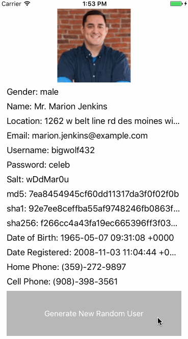

<p align="center">
  
</p>

[](https://travis-ci.org/dingwilson/RandomUserSwift)
[][podLink]
[](https://github.com/Carthage/Carthage)
[](https://cocoapods.org/pods/RandomUserSwift)
[](https://cocoapods.org/pods/RandomUserSwift)

[](https://swift.org)
[][mitLink]

<p align="center">
  
</p>

RandomUserSwift is an easy to use Swift framework that provides the ability to generate Random Users and their accompanying data for your Swift applications. It utilizes [randomuser.me](http://www.randomuser.me) API to generate the data.

1. [Integration](#integration)
    - [Cocoapods](#cocoapods)
    - [Carthage](#carthage)
2. [Usage](#usage)
3. [Example](#example)
4. [License](#license)

## Integration

#### CocoaPods
You can use [CocoaPods](http://cocoapods.org/) to install `RandomUserSwift`by adding it to your `Podfile`:
```ruby
target 'MyApp' do
	pod 'RandomUserSwift'
end
```

#### Carthage
You can use [Carthage](https://github.com/Carthage/Carthage) to install `RandomUserSwift` by adding it to your `Cartfile`:
```
github "dingwilson/RandomUserSwift"
```

## Usage

Import the framework into the ViewController

```swift
import RandomUserSwift
```

Define a randomUser object, which you will use to get a random user.

```swift
var randomUser: RandomUser! = RandomUser()
```

(Optional) You can select the gender of the users you wish to recieve. Possible selections include `both`, `male`, or `female`. The default is `both`.

```swift
randomUser.gender = "male"
```

(Optional) You can select the nationality of the users you wish to recieve. Possible selections include `au,br,ca,ch,de,dk,es,fi,fr,gb,ie,ir,nl,nz,tr,us`. You can select multiple nationalities by chaining them together with a comma in between. The default is `us`. 

```swift
randomUser.nationality = "us,dk,fr,gb"
```

Use the `getUser` function with a completion handler, and set the `user` response equal to a `User` object. You can then loop through the object and gather whatever data you are interested in. Possible datapoints include `gender`,`title`,`firstName`,`lastName`,`street`,`city`,`state`,`zip`,`email`,`username`,`password`,`salt`,`md5`,`sha1`,`sha256`,`dateOfBirth`,`dateRegistered`,`homePhone`,`cellPhone`,`pictureLargeURL`,`pictureMediumURL`,`pictureThumbnailURL`.

```swift
randomUser.getUser { success, user in
    if success {
        if let randUser = user as? User {
            // You can now access every aspect of the user.
            print(randUser)
        }
    }
}
```

## Example

To view the included example `RandomUserGenerator`, simply run `pod install` to get the latest version of the `RandomUserSwift`, and then open the `RandomUserGenerator.xcworkspace` and run on a compatible iPhone simulator or iOS device.

## License

`RandomUserSwift` is released under an [MIT License][mitLink]. See `LICENSE` for details.

**Copyright &copy; 2016-present Wilson Ding.**

*Please provide attribution, it is greatly appreciated.*

[podLink]:https://cocoapods.org/pods/RandomUserSwift
[mitLink]:http://opensource.org/licenses/MIT
